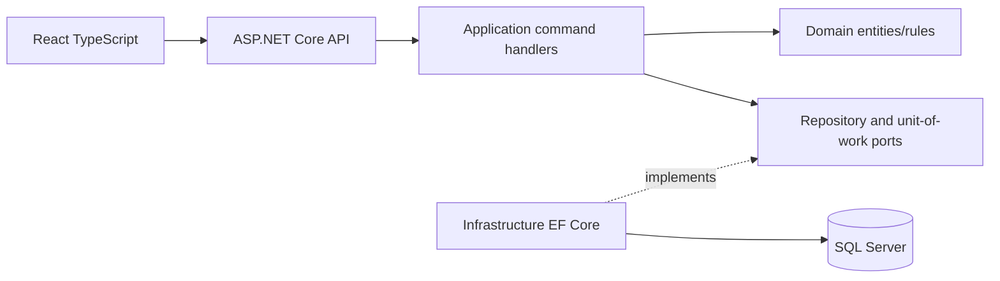

# Architecture

The dependency direction is inward: Domain has no infrastructure dependency; Application references Domain and defines ports; Infrastructure references both; API composes everything. Commands make state changes explicit and are independently testable.
