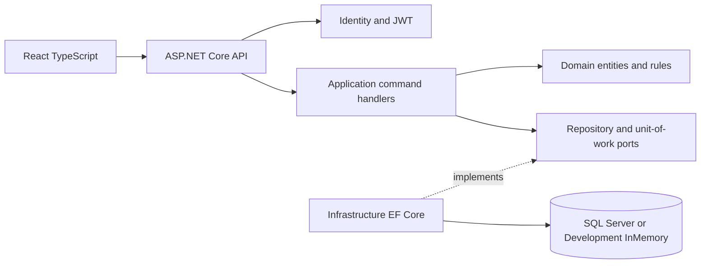
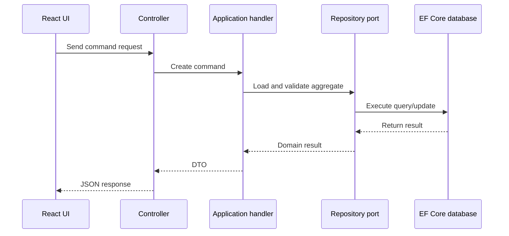

# Architecture

## Dependency flow

The dependency direction is inward:

- **Domain** contains products, carts, orders, stock rules, and status values.
- **Application** defines commands, handlers, DTOs, repositories, and unit-of-work ports.
- **Infrastructure** implements EF Core repositories, Identity stores, SQL Server, and the Development in-memory provider.
- **API** composes services, validates JWTs, exposes controllers, and applies CORS.
- **Frontend** provides route-aware pages and calls public or authenticated API endpoints.

## Command handler flow

## Authentication boundary

Registration and login are handled by ASP.NET Core Identity. Successful authentication returns a JWT containing the user identifier. The API uses `[Authorize]` for customer cart, order, and checkout operations. The current admin screen is a UI foundation; production admin operations should use role claims and `[Authorize(Roles = "Admin")]`.

## Development versus production

Development uses `UseInMemoryDatabase("ECommerceDevelopment")` and seeds sample products so the app can run without Docker. Non-development environments use the configured SQL Server connection string and should apply EF migrations during deployment.
