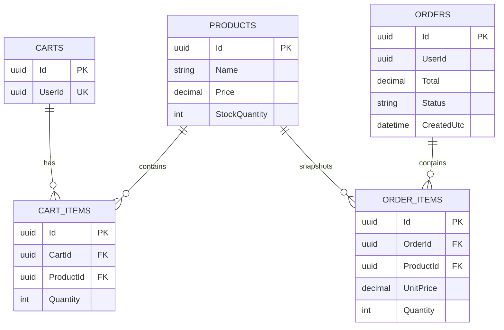

# Database design

SQL Server database: `ECommerceDb`.

## Tables

- `Products`: catalog data, price, active flag, and stock. Index `(IsActive, Name)` supports the catalog query.
- `Carts`: one active cart per user, enforced by unique index on `UserId`.
- `CartItems`: cart/product quantities, enforced unique by `(CartId, ProductId)`.
- `Orders`: immutable checkout header, status, total, and UTC creation time. Index `(UserId, CreatedUtc)` supports order history.
- `OrderItems`: price/name snapshots preserve historical order values even if the product changes.

## Query optimization

Use `AsNoTracking()` for catalog and order-history reads. Select only required columns for public list endpoints as the API grows. Keep predicates aligned with the indexes, use UTC timestamps, inspect actual execution plans for large catalogs, and use pagination before production scale. Avoid lazy loading and N+1 queries; repositories explicitly include cart items and order aggregates.

## Migration workflow

```powershell
dotnet ef migrations add InitialCreate --project src/Backend/ECommerce.Infrastructure --startup-project src/Backend/ECommerce.Api
dotnet ef database update --project src/Backend/ECommerce.Infrastructure --startup-project src/Backend/ECommerce.Api
```

## ER diagram


