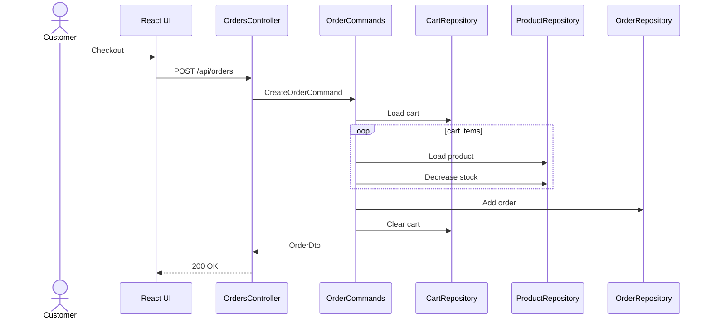
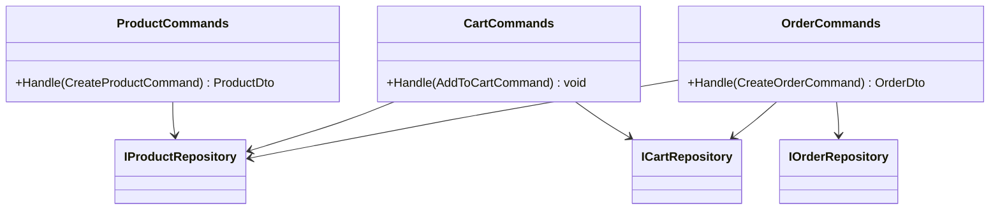

# UML diagrams

## Checkout sequence

```mermaid
sequenceDiagram
  actor Customer
  participant UI as React UI
  participant API as OrdersController
  participant Handler as OrderCommands
  participant Cart as CartRepository
  participant Products as ProductRepository
  participant Orders as OrderRepository
  Customer->>UI: Checkout
  UI->>API: POST /api/orders
  API->>Handler: CreateOrderCommand
  Handler->>Cart: Load cart
  loop cart items
	Handler->>Products: Load product
	Handler->>Products: Decrease stock
  end
  Handler->>Orders: Add order
  Handler->>Cart: Clear cart
  Handler-->>API: OrderDto
  API-->>UI: 200 OK
```

## Command class model

```mermaid
classDiagram
  class ProductCommands { +Handle(CreateProductCommand) ProductDto }
  class CartCommands { +Handle(AddToCartCommand) void }
  class OrderCommands { +Handle(CreateOrderCommand) OrderDto }
  class IProductRepository
  class ICartRepository
  class IOrderRepository
  ProductCommands --> IProductRepository
  CartCommands --> ICartRepository
  CartCommands --> IProductRepository
  OrderCommands --> ICartRepository
  OrderCommands --> IProductRepository
  OrderCommands --> IOrderRepository
```
