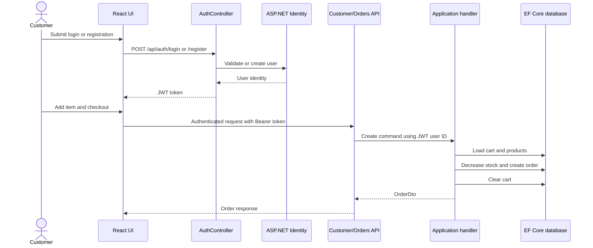
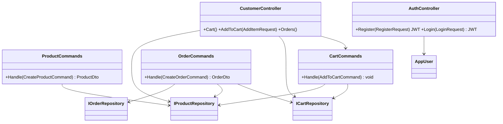

# UML diagrams

## Authentication and checkout sequence



## Command class model



## Frontend route map

```mermaid
graph TD
  Home[/]
  Home --> Product[/products/:id]
  Home --> Cart[/cart]
  Cart --> Checkout[/checkout]
  Checkout --> Orders[/orders]
  Home --> Login[/login]
  Login --> Register[/register]
  Login --> Account[/account]
  Home --> Admin[/admin]
  Admin --> AdminProducts[/admin/products]
  Unknown --> NotFound[NotFound]
